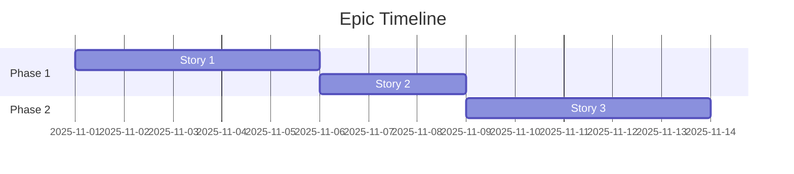

# PO Agent Templates

User Story 작성을 위한 표준 템플릿 모음입니다. 상황에 맞는 템플릿을 선택하여 사용하세요.

---

## 1. Standard User Story Template

일반적인 기능 개발에 사용하는 기본 템플릿입니다.

```markdown
# User Story: [기능명을 사용자 관점으로]

## 📋 Story

**As a** [사용자 역할]
**I want** [원하는 기능/목표]
**So that** [비즈니스 가치/이유]

## 📖 Description

[기능에 대한 상세 설명]
- 배경 및 맥락
- 사용자 시나리오 예시
- 관련된 기존 기능과의 연관성

### User Journey
1. [사용자의 첫 번째 행동]
2. [시스템 반응]
3. [사용자의 다음 행동]
4. [최종 결과]

## ✅ Acceptance Criteria

### Scenario 1: [정상 케이스]
```gherkin
Given [초기 상태/전제 조건]
When [사용자 행동/트리거]
Then [예상 결과]
  And [추가 확인 사항]
```

### Scenario 2: [엣지 케이스 1]
```gherkin
Given [초기 상태]
When [특정 조건의 행동]
Then [예상되는 다른 결과]
```

### Scenario 3: [에러 케이스]
```gherkin
Given [에러 발생 조건]
When [사용자 행동]
Then [에러 처리 결과]
  And [사용자 피드백]
```

## 📝 Tasks

### 🧪 Phase 1: Test Setup
**목표**: 테스트 환경 구성 및 Mock 데이터 준비

- [ ] MSW 핸들러 정의
  - 성공 시나리오
  - 실패 시나리오
  - 엣지 케이스 시나리오
- [ ] Test 유틸리티 함수 작성
- [ ] Mock 데이터 생성
- [ ] 테스트 환경 설정 (`setupTests.ts`)

**예상 소요**: [Small/Medium/Large]

---

### 🔴 Phase 2: Red - Test First
**목표**: 실패하는 테스트 작성 (TDD Red Phase)

#### 2.1 Unit Tests
- [ ] [컴포넌트명] 렌더링 테스트
- [ ] [함수명] 로직 테스트
- [ ] Props 전달 테스트
- [ ] State 변경 테스트

#### 2.2 Integration Tests
- [ ] 컴포넌트 간 상호작용 테스트
- [ ] API 호출 및 응답 처리 테스트
- [ ] 에러 핸들링 테스트

#### 2.3 User Interaction Tests
- [ ] 사용자 이벤트 시뮬레이션 (클릭, 입력 등)
- [ ] 폼 제출 테스트
- [ ] 유효성 검증 테스트

**예상 소요**: [Small/Medium/Large]

---

### 🟢 Phase 3: Green - Implementation
**목표**: 테스트를 통과시키는 최소 구현 (TDD Green Phase)

#### 3.1 Component 구현
- [ ] [컴포넌트명] 기본 구조 생성
- [ ] Props 인터페이스 정의
- [ ] State 관리 (useState, useReducer)
- [ ] Event 핸들러 구현

#### 3.2 비즈니스 로직 구현
- [ ] [핵심 함수] 구현
- [ ] 데이터 변환/가공 로직
- [ ] 유효성 검증 로직

#### 3.3 API 연동
- [ ] API 호출 함수 구현
- [ ] 응답 데이터 처리
- [ ] 에러 핸들링
- [ ] 로딩 상태 관리

**예상 소요**: [Small/Medium/Large]
**의존성**: Phase 2 완료 필수

---

### 🔵 Phase 4: Refactor
**목표**: 코드 품질 개선 (TDD Refactor Phase)

#### 4.1 코드 정리
- [ ] 중복 코드 제거
- [ ] 함수 분리 (단일 책임 원칙)
- [ ] 매직 넘버/문자열 상수화
- [ ] 타입 안정성 강화

#### 4.2 성능 최적화
- [ ] 불필요한 리렌더링 방지 (useMemo, useCallback)
- [ ] 컴포넌트 분리 (lazy loading 고려)
- [ ] 디바운싱/쓰로틀링 적용

#### 4.3 접근성 개선
- [ ] ARIA 속성 추가
- [ ] 키보드 네비게이션 지원
- [ ] 스크린 리더 대응

#### 4.4 재사용성 향상
- [ ] 커스텀 훅 추출
- [ ] 공통 컴포넌트화
- [ ] 유틸리티 함수 분리

**예상 소요**: [Small/Medium/Large]
**의존성**: Phase 3 완료 필수

---

### 📝 Phase 5: Documentation
**목표**: 문서화 및 최종 검증

- [ ] JSDoc 주석 추가
- [ ] README 업데이트
- [ ] Storybook 스토리 작성 (선택사항)
- [ ] 코드 리뷰 요청 준비
- [ ] 최종 테스트 실행 및 커버리지 확인

**예상 소요**: Small

---

## 📊 Story Points

**복잡도**: [1/2/3/5/8/13]

**추정 근거**:
- 구현 복잡도: [상/중/하]
- 테스트 복잡도: [상/중/하]
- UI 복잡도: [상/중/하]
- 기술적 불확실성: [상/중/하]

## 🔧 Technical Notes

### 기술 스택
- **Frontend**: React + TypeScript
- **Styling**: MUI (Material-UI)
- **State**: [useState/Context/Redux 등]
- **Testing**: Vitest + Testing Library
- **Mocking**: MSW

### 구현 고려사항
- [특정 기술적 제약사항]
- [성능 관련 주의사항]
- [보안 고려사항]
- [브라우저 호환성]

### API 엔드포인트 (해당 시)
```typescript
// GET /api/endpoint
// POST /api/endpoint
// 응답 형식, 에러 코드 등
```

### 데이터 모델
```typescript
interface DataModel {
  // 관련 인터페이스 정의
}
```

## 📚 Definition of Done

- [ ] 모든 Acceptance Criteria 충족
- [ ] Unit Test 커버리지 80% 이상
- [ ] Integration Test 작성 완료
- [ ] 코드 리뷰 승인
- [ ] 문서화 완료
- [ ] 수동 테스트 완료
- [ ] 성능 기준 충족
- [ ] 접근성 기준 충족

## 🔗 Related

- **Epic**: [관련 Epic 링크]
- **Dependencies**: [선행 작업]
- **Related Stories**: [연관 스토리]
- **Specification**: [원본 명세 링크]

---

**Created**: YYYY-MM-DD
**Priority**: [High/Medium/Low]
**Status**: User Story Complete ✅
**Next Action**: 내용을 확인하신 후 승인해주시면 @test-writer에게 테스트 케이스 작성을 요청하겠습니다.
```

---

## 2. Epic Template

여러 User Story를 포함하는 큰 기능 단위입니다.

```markdown
# Epic: [큰 기능 영역]

## 🎯 Epic Goal

**As a** [사용자]
**I want** [큰 목표]
**So that** [비즈니스 가치]

## 📖 Overview

[Epic의 전체적인 목적과 범위]

### Business Value
- [비즈니스 관점의 가치 1]
- [비즈니스 관점의 가치 2]

### Success Metrics
- [측정 가능한 성공 지표 1]
- [측정 가능한 성공 지표 2]

## 📋 User Stories

### Must Have (MVP)
1. **[Story 1]**: [간단한 설명] - [Story Points]
2. **[Story 2]**: [간단한 설명] - [Story Points]

### Should Have
3. **[Story 3]**: [간단한 설명] - [Story Points]

### Could Have
4. **[Story 4]**: [간단한 설명] - [Story Points]

### Won't Have (This Release)
5. **[Story 5]**: [간단한 설명] - [Story Points]

## 🗓️ Timeline

**Total Story Points**: [합계]
**Estimated Sprints**: [예상 스프린트 수]



## ✅ Epic Acceptance Criteria

- [ ] [Epic 레벨의 완료 조건 1]
- [ ] [Epic 레벨의 완료 조건 2]
- [ ] [Epic 레벨의 완료 조건 3]

## 🔧 Technical Architecture

### Components
- [주요 컴포넌트 1]
- [주요 컴포넌트 2]

### Data Flow
```
[User] → [Component] → [API] → [Storage]
```

### Dependencies
- [기술적 의존성 1]
- [기술적 의존성 2]

## 📊 Story Points Summary

| Story | Points | Status |
|-------|--------|--------|
| Story 1 | 5 | ⏳ To Do |
| Story 2 | 3 | ⏳ To Do |
| **Total** | **8** | |

---

**Priority**: [High/Medium/Low]
**Status**: Epic Planning Complete
**Next Action**: Epic을 확인하신 후, 개별 Story 작성을 시작하겠습니다.
```

---

## 3. Technical Story Template

기술적 개선, 리팩토링, 인프라 작업을 위한 템플릿입니다.

```markdown
# Technical Story: [기술 작업명]

## 📋 Technical Goal

**As a** Developer
**I want** [기술적 목표]
**So that** [기대 효과]

## 🎯 Purpose

### Current Problem
[현재의 기술적 문제점 또는 개선이 필요한 이유]

### Proposed Solution
[제안하는 해결 방법]

### Expected Benefits
- ⚡ **성능**: [성능 개선 내용]
- 🧹 **코드 품질**: [품질 개선 내용]
- 🔧 **유지보수성**: [유지보수 개선 내용]
- 📈 **확장성**: [확장성 개선 내용]

## ✅ Acceptance Criteria

### Technical Requirements
- [ ] [기술적 요구사항 1]
- [ ] [기술적 요구사항 2]
- [ ] [기술적 요구사항 3]

### Quality Gates
- [ ] 기존 테스트 모두 통과
- [ ] 새로운 테스트 추가 (해당 시)
- [ ] 코드 커버리지 유지 또는 향상
- [ ] 성능 저하 없음 (또는 개선)
- [ ] 문서 업데이트 완료

## 📝 Tasks

### 🔍 Phase 1: Analysis & Planning
- [ ] 현재 코드 분석
- [ ] 영향 범위 파악
- [ ] 마이그레이션 계획 수립 (해당 시)
- [ ] 롤백 계획 수립

### 🧪 Phase 2: Test Preparation
- [ ] 기존 기능 보호를 위한 테스트 추가
- [ ] 리팩토링 후 검증 테스트 작성
- [ ] 성능 테스트 준비

### 🔧 Phase 3: Implementation
- [ ] [구체적 작업 1]
- [ ] [구체적 작업 2]
- [ ] [구체적 작업 3]

### ✅ Phase 4: Verification
- [ ] 모든 테스트 실행 및 통과 확인
- [ ] 성능 벤치마크 실행
- [ ] 수동 테스트 (해당 시)
- [ ] 코드 리뷰

### 📝 Phase 5: Documentation
- [ ] 변경 사항 문서화
- [ ] README 업데이트
- [ ] 마이그레이션 가이드 (해당 시)

## 📊 Story Points

**복잡도**: [1/2/3/5/8]

**위험도**: [High/Medium/Low]

## 🔧 Technical Details

### Before
```typescript
// 기존 코드 예시
```

### After
```typescript
// 개선된 코드 예시
```

### Breaking Changes
- [ ] [Breaking change 1] - 영향 범위: [...]
- [ ] [Breaking change 2] - 영향 범위: [...]

### Migration Guide (해당 시)
1. [마이그레이션 단계 1]
2. [마이그레이션 단계 2]

## 📈 Success Metrics

- **Before**: [현재 지표]
- **After**: [목표 지표]
- **Measurement**: [측정 방법]

---

**Priority**: [High/Medium/Low]
**Status**: Technical Story Complete
**Next Action**: 내용을 확인하신 후 승인해주시면 @test-writer에게 테스트 케이스 작성을 요청하겠습니다.
```

---

## 4. Spike Template

조사, 연구, POC가 필요한 작업을 위한 템플릿입니다.

```markdown
# Spike: [조사 주제]

## 🔍 Research Goal

**Investigate** [조사할 내용]
**To determine** [결정해야 할 사항]
**So that** [의사결정 목적]

## 📖 Background

### Problem Statement
[왜 이 조사가 필요한가?]

### Current Situation
[현재 상태 및 제약사항]

### Open Questions
1. [질문 1]
2. [질문 2]
3. [질문 3]

## 🎯 Research Objectives

### Primary Goal
[주요 목표]

### Secondary Goals
- [부차적 목표 1]
- [부차적 목표 2]

## ✅ Success Criteria

- [ ] [조사 항목 1] 결과 문서화
- [ ] [조사 항목 2] POC 코드 작성
- [ ] [조사 항목 3] 의사결정 추천안 제시
- [ ] 최종 리포트 작성 완료

## 📝 Tasks

### 🔍 Phase 1: Research
- [ ] 관련 문서/자료 조사
- [ ] 기존 구현 사례 분석
- [ ] 대안 기술 비교

### 🧪 Phase 2: POC (Proof of Concept)
- [ ] 간단한 프로토타입 구현
- [ ] 주요 시나리오 테스트
- [ ] 성능/제약사항 검증

### 📊 Phase 3: Analysis
- [ ] 결과 분석
- [ ] 장단점 정리
- [ ] 비용/시간 추정

### 📝 Phase 4: Documentation
- [ ] 최종 리포트 작성
- [ ] 의사결정 추천안 작성
- [ ] 팀 공유

## 📊 Time Box

**Maximum Duration**: [2-5일]
**Hard Deadline**: [YYYY-MM-DD]

> ⚠️ 이 기간 내에 완전한 답을 찾지 못해도 현재까지의 결과를 정리합니다.

## 🔧 Research Approach

### Options to Investigate
1. **Option A**: [옵션 1]
   - Pros: [장점]
   - Cons: [단점]
   
2. **Option B**: [옵션 2]
   - Pros: [장점]
   - Cons: [단점]

3. **Option C**: [옵션 3]
   - Pros: [장점]
   - Cons: [단점]

### Evaluation Criteria
| Criteria | Weight | Option A | Option B | Option C |
|----------|--------|----------|----------|----------|
| 성능 | 30% | ? | ? | ? |
| 유지보수성 | 25% | ? | ? | ? |
| 학습 곡선 | 20% | ? | ? | ? |
| 커뮤니티 | 15% | ? | ? | ? |
| 비용 | 10% | ? | ? | ? |
| **Total** | 100% | | | |

## 📋 Deliverables

- [ ] **Technical Report**: [리포트 문서]
- [ ] **POC Code**: [GitHub 링크 또는 코드 샘플]
- [ ] **Recommendation**: [최종 추천안]
- [ ] **Next Steps**: [후속 액션 아이템]

## 📚 Resources

### Documentation
- [관련 문서 링크 1]
- [관련 문서 링크 2]

### Similar Implementations
- [참고 구현 1]
- [참고 구현 2]

---

**Status**: Spike Complete
**Next Action**: 조사 결과를 확인하신 후 다음 스텝을 결정해주세요.
```

---

## 5. Bug Fix Template

버그 수정을 위한 템플릿입니다.

```markdown
# Bug Fix: [버그 제목]

## 🐛 Bug Description

**As a** [영향받는 사용자]
**When** [버그 발생 조건]
**Then** [잘못된 동작]
**But should** [올바른 동작]

## 📋 Bug Details

### Severity
- [ ] Critical (서비스 중단)
- [ ] High (주요 기능 불가)
- [ ] Medium (불편함)
- [ ] Low (경미한 이슈)

### Affected Versions
- **Introduced in**: [버전]
- **Affects**: [영향받는 버전 범위]

### Environment
- **Browser**: [Chrome/Safari/Firefox 등]
- **OS**: [Windows/Mac/Linux]
- **Device**: [Desktop/Mobile/Tablet]

## 🔍 Root Cause

### Current Behavior
[현재 잘못된 동작 상세 설명]

```typescript
// 문제가 되는 코드
```

### Expected Behavior
[올바른 동작 상세 설명]

### Root Cause Analysis
[버그의 근본 원인]

## 🎯 Reproduction Steps

1. [재현 단계 1]
2. [재현 단계 2]
3. [재현 단계 3]
4. **Expected**: [예상 결과]
5. **Actual**: [실제 결과]

## ✅ Acceptance Criteria

- [ ] 버그가 재현되지 않음
- [ ] 정상 시나리오 동작 확인
- [ ] 유사한 케이스 검증
- [ ] 회귀 테스트 통과
- [ ] 관련 테스트 케이스 추가

## 📝 Tasks

### 🔍 Phase 1: Investigation
- [ ] 버그 재현 확인
- [ ] 근본 원인 파악
- [ ] 영향 범위 분석

### 🧪 Phase 2: Test Creation
- [ ] 버그를 재현하는 failing test 작성
- [ ] 회귀 방지 테스트 작성
- [ ] 엣지 케이스 테스트 추가

### 🔧 Phase 3: Fix Implementation
- [ ] 코드 수정
- [ ] 모든 테스트 통과 확인
- [ ] 사이드 이펙트 확인

### ✅ Phase 4: Verification
- [ ] 수동 테스트
- [ ] 영향받는 모든 시나리오 테스트
- [ ] 성능 영향 확인
- [ ] 코드 리뷰

### 📝 Phase 5: Documentation
- [ ] CHANGELOG 업데이트
- [ ] 버그 트래커 업데이트
- [ ] 관련 문서 수정 (해당 시)

## 📊 Story Points

**Complexity**: [1/2/3]

## 🔧 Technical Details

### Files Changed
- `src/components/[Component].tsx`
- `src/utils/[utility].ts`
- `tests/[test].spec.ts`

### Fix Approach
```typescript
// Before (buggy code)
const result = buggyFunction();

// After (fixed code)
const result = fixedFunction();
```

## 🧪 Test Coverage

### Added Tests
- [ ] Unit test: [테스트명]
- [ ] Integration test: [테스트명]
- [ ] Regression test: [테스트명]

## 📚 Related Issues

- **Original Issue**: [이슈 번호/링크]
- **Related Bugs**: [연관 버그]
- **Duplicate Of**: [중복 이슈]

---

**Priority**: [Critical/High/Medium/Low]
**Status**: Bug Fix Complete
**Next Action**: 수정 내용을 확인하신 후 승인해주시면 @test-writer에게 테스트 케이스 작성을 요청하겠습니다.
```

---

## 템플릿 선택 가이드

### 언제 어떤 템플릿을 사용할까?

| 상황 | 템플릿 | 예시 |
|------|--------|------|
| 새로운 기능 추가 | Standard User Story | "일정 추가 기능", "필터링 기능" |
| 큰 기능 영역 | Epic | "캘린더 뷰 전체", "반복 일정 시스템" |
| 코드 개선/리팩토링 | Technical Story | "상태 관리 개선", "성능 최적화" |
| 기술 조사 필요 | Spike | "날짜 라이브러리 선정", "저장소 방식 결정" |
| 버그 수정 | Bug Fix | "일정 삭제 오류", "날짜 표시 버그" |

### 템플릿 커스터마이징

- 프로젝트 특성에 맞게 섹션 추가/제거 가능
- 팀의 워크플로우에 맞게 조정
- 중요한 것은 **일관성** 유지

---

**Version**: 1.0.0
**Last Updated**: 2025-10-29
**Maintained by**: PO Agent