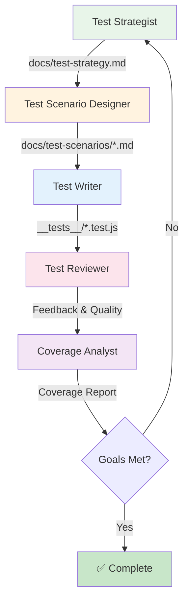

# BMad Test Automation Expansion Pack

테스트 코드 작성 및 자동화를 위한 BMad Method 확장팩입니다.

## 📋 개요

이 Expansion Pack은 소프트웨어 테스트 코드 작성과 자동화를 전문으로 하는 AI 에이전트 팀을 제공합니다.

## ✨ 주요 기능

- 🧪 **테스트 코드 작성**: 포괄적이고 유지보수 가능한 테스트 코드 생성
- 📊 **커버리지 분석**: 테스트 커버리지 분석 및 개선 제안
- 🎯 **테스트 전략**: 프로젝트에 맞는 테스트 전략 수립
- ✅ **코드 리뷰**: 테스트 코드 품질 검토 및 개선
- 🤖 **자동화 설정**: CI/CD 통합 및 테스트 인프라 구성

## 👥 에이전트 팀 (권장 순서)

### 1. Test Strategist (스트라텔) 📋

**역할**: 테스트 전략 수립 - "왜 테스트하는가?"  
**특징**:

- 프로젝트 분석 및 리스크 평가
- 테스트 전략 문서 작성
- Test Pyramid 적용 계획
- 테스트 우선순위 결정 (P0/P1/P2)
- 커버리지 목표 수립

**출력물**:

- `docs/test-strategy.md` - 테스트 전략 문서
- 리스크 기반 테스트 우선순위
- 각 컴포넌트별 테스트 접근 방식

### 2. Test Scenario Designer (세나리오) 📝

**역할**: 테스트 시나리오 설계 - "무엇을 테스트하는가?"  
**특징**:

- 구체적인 테스트 시나리오 작성
- Given-When-Then 스타일 시나리오
- Edge case 및 에러 경로 식별
- 테스트 데이터 설계

**출력물**:

- `docs/test-scenarios/{component}.md` - 테스트 시나리오 문서
- 시나리오 카탈로그
- 테스트 케이스 목록

### 3. Test Writer (테스타) ✍️

**역할**: 테스트 코드 작성 - "어떻게 테스트하는가?"  
**특징**:

- 테스트 코드 구현
- AAA 패턴 (Arrange-Act-Assert)
- 의존성 모킹 및 스텁
- 실제 실행 가능한 테스트 코드

**입력**: Test Strategist + Test Scenario Designer의 산출물
**출력**: `__tests__/component.test.js`

### 4. Test Documenter (도큐) 📚

**역할**: 문서화 및 가이드 작성  
**특징**:

- README 생성 및 업데이트
- 테스트 문서화
- API 문서 생성
- 테스트 가이드 작성
- 코드 주석 개선

**출력물**:

- `README.md` - 프로젝트 개요
- `docs/testing-guide.md` - 테스트 가이드
- `docs/api.md` - API 문서
- 코드 JSDoc 주석

### 5. Test Reviewer (리뷰어)

**역할**: 테스트 코드 리뷰 및 품질 검증  
**특징**:

- 테스트 품질 검증
- 커버리지 분석
- Best practice 준수 확인
- 개선 제안

### 6. Coverage Analyst (커버리지)

**역할**: 테스트 커버리지 분석 및 모니터링

## 🚀 사용 방법

### 방법 1: 수동 설치 (지금 바로 사용 가능)

현재 이 Expansion Pack은 개발 중이므로 수동으로 복사해야 합니다:

```bash
# 1. 당신의 프로젝트로 이동
cd /your/project

# 2. Expansion Pack 전체 복사
cp -r /path/to/BMAD-METHOD/expansion-packs/bmad-test-automation/.bmad-test-automation .

# 3. Cursor나 다른 IDE에서 사용
@test-strategist *create-strategy
```

### 방법 2: BMad 설치자 통합 (권장)

BMad 프로젝트 자체를 수정:

```bash
# 1. BMAD-METHOD 저장소 포크/클론
cd BMAD-METHOD

# 2. expansion-packs/ 폴더에 bmad-test-automation/ 추가 (이미 있음)

# 3. package.json에 expansion pack 추가
# expansion-packs/package.json에 추가

# 4. 빌드
npm run build

# 5. 배포하거나 로컬에서 사용
```

### 시작하기: 올바른 순서 (BMAD-METHOD 철학에 맞게)

#### ✅ 추천 플로우

**1단계: Test Strategist** - 왜 테스트하는가?

```bash
@test-strategist *create-strategy
# 전체 프로젝트 또는 컴포넌트의 테스트 전략 수립
# Risk 기반 우선순위 결정 (P0/P1/P2)
# 출력: docs/test-strategy.md
```

**2단계: Test Scenario Designer** - 무엇을 테스트하는가?

```bash
@test-scenario-designer *create-scenarios UserAuth
# 구체적인 테스트 시나리오 설계
# Given-When-Then 스타일
# Edge case 식별
# 출력: docs/test-scenarios/user-auth.md
```

**3단계: Test Writer** - 어떻게 테스트하는가?

```bash
@test-writer *write-tests src/components/UserAuth.tsx
# 실제 테스트 코드 구현
# 에이전트는 전략 + 시나리오를 참고하여 작성
# 출력: src/components/__tests__/UserAuth.test.tsx
```

**4단계: Test Documenter** - 문서화하기

```bash
@test-documenter *create-readme .
# 프로젝트 README 생성/업데이트
# 출력: README.md

@test-documenter *document-tests src/__tests__
# 테스트 문서화
# 출력: docs/testing-guide.md
```

### 빠른 시작 (개발 중인 확장팩 사용)

```bash
# 1. 프로젝트에 Expansion Pack 구조 복사
cp -r expansion-packs/bmad-test-automation/.bmad-test-automation /your/project/

# 2. IDE에서 사용
@test-strategist help  # 전략 수립
@test-scenario-designer help  # 시나리오 작성
@test-writer help  # 코드 구현
@test-documenter help  # 문서화
```

### 2단계: 수동 설치 (개발 중인 확장팩)

```bash
# 1. Expansion Pack 클론
cd expansion-packs/bmad-test-automation

# 2. 프로젝트에 수동으로 복사
cp -r expansion-packs/bmad-test-automation/.bmad-test-automation /your/project/
```

## 📚 사용 예시

### 예시 1: 새로운 파일 테스트 작성

```
User: @test-writer calculateDiscount 함수에 대한 테스트를 작성해줘
Agent: 코드를 분석하고 테스트를 생성 중...
       - Happy path: 정상 할인 계산
       - Edge cases: 0%, 100% 할인
       - Error cases: 음수 입력, null 처리
```

### 예시 2: 기존 테스트 개선

```
User: @test-writer src/components/Button.test.tsx 를 리뷰하고 개선해줘
Agent: 테스트 코드 분석 중...
       - ❌ Edge case 없음
       - ❌ Mock 설정 미흡
       - ✅ AAA 패턴 준수
       - 제안: 다음과 같이 개선...
```

## 📁 구조

```
bmad-test-automation/
├── agents/
│   └── test-writer.md          # 테스트 작성 에이전트
├── tasks/
│   ├── write-tests.md          # 테스트 작성 태스크
│   ├── analyze-coverage.md     # 커버리지 분석 태스크
│   └── generate-test-scenarios.md
├── data/
│   ├── test-patterns.md        # 테스트 패턴 및 Best Practice
│   └── testing-standards.md    # 테스팅 표준
└── config.yaml                 # 패키지 설정
```

## 📊 전체 워크플로우



## 🎯 현재 상태

### ✅ 완료된 에이전트

1. **Test Strategist** (스트라텔) 📋 - 전략 수립
2. **Test Scenario Designer** (세나리오) 📝 - 시나리오 설계
3. **Test Writer** (테스타) ✍️ - 코드 구현
4. **Test Documenter** (도큐) 📚 - 문서화 (NEW!)

### 🚧 개발 예정

1. **Test Reviewer** (리뷰어) - 코드 리뷰 및 품질 검증
2. **Coverage Analyst** (커버리지) - 커버리지 분석
3. **Workflows** - 전체 프로세스 자동화

## 📝 다음 단계

원하는 에이전트를 선택해서 만들 수 있습니다:

1. **Test Documenter (도큐)** ✅ - 문서화 전담 에이전트 (완료!)
2. **Test Reviewer 추가** - 구현된 테스트 코드 품질 검토
3. **Coverage Analyst 추가** - 커버리지 분석 및 레포팅
4. **Workflow 추가** - 전체 프로세스 자동화
5. **체크리스트 추가** - 품질 검증 체크리스트

### 🆕 새로 추가된 기능

**Test Documenter (도큐)** 📚

- README 자동 생성 및 업데이트
- 테스트 가이드 문서화
- API 문서 생성
- 코드 주석 개선
- 문서 품질 검증

**사용법**:

```bash
@test-documenter *create-readme .              # README 생성
@test-documenter *document-tests src/__tests__ # 테스트 문서화
@test-documenter *document-api src/hooks       # API 문서화
@test-documenter *review-docs                  # 문서 검토
```

## 🤝 기여하기

이 Expansion Pack은 계속 발전 중입니다. 에이전트 추가, 개선 제안, 버그 리포트를 환영합니다!
